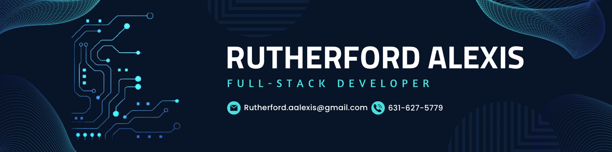

<h3 align="center">
Hi there, I'm Rutherford 👋
</h3>

<h2 align="center">
I'm a Full Stack Web Developer
</h2>

<h3 align="left">About me:</h3>

-   🌱 I'm learning Python and C++
-   ⚡ Fun fact **I am resto-moding a BMW 3 series**

-   📫 How to reach me **rutherford.aalexis@gmail.com**

<h3 align="left">Connect with me:</h3>

<h3 align="left">Languages and Tools:</h3>

                      

&nbsp;

